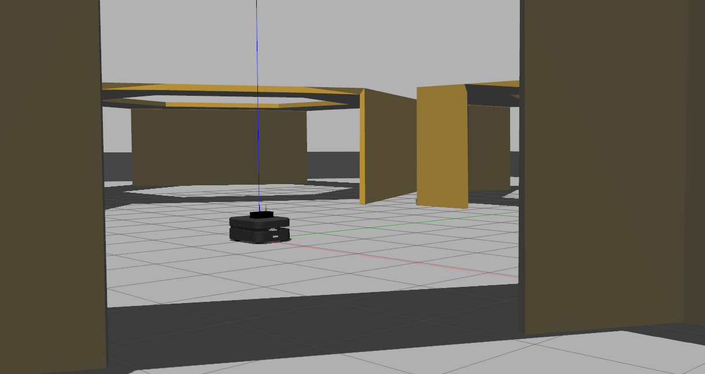
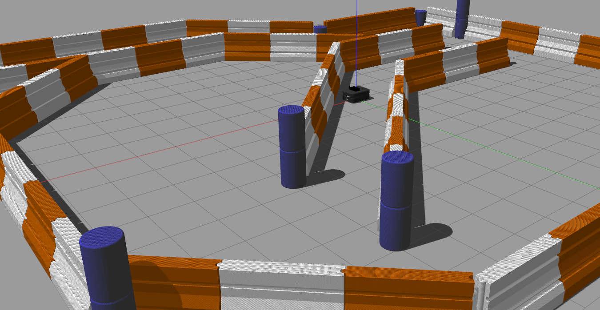

boxer_simulation
==================

This repository contains the Gazebo simulation packages for Boxer 2.4.


Usage
------

The default world is fairly open with large hexagonal chambers

```bash
roslaunch boxer_gazebo boxer_world.launch
```



A secondary racetrack world is also available, featuring more narrow corridors and a few open areas.

```bash
roslaunch boxer_gazebo boxer_race.launch
```




Sensor Simulations
-------------------

The Gazebo properties of `boxer_description` enable the 4 standard sensors on the Otto 100 to be used inside Gazebo.
This includes a front RealSense D435, front & rear lidars, and an IMU.

Note that we use the Kinect gazebo plugin to simulate the RealSense, which publishes pointcloud and RGB data, in
addition to the depth image.  On the real Boxer only the depth image is made available from the base-platform.
